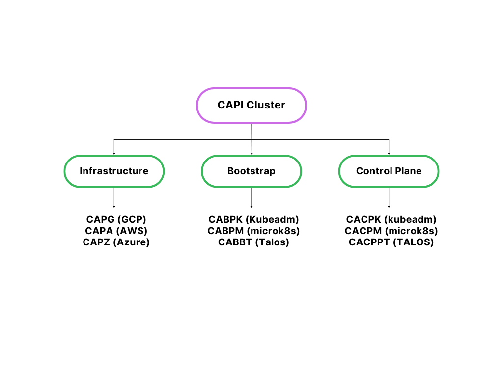

**First Slide:**

- As Kubernetes adoption grows, one of the biggest challenges is not running a single cluster, but managing many clusters across different environments — cloud, on-prem, and edge.
- That’s where tools for cluster lifecycle management come in: we need ways to provision new clusters, upgrade existing ones, scale them up and down, and ensure governance and security.
- In this session, we’ll look at two different but important solutions:
- Rancher, which provides an enterprise-grade operations platform with a UI, security, and fleet management.
- Cluster API, which is a Kubernetes-native declarative framework that treats clusters as objects and manages them through CRDs and controllers.
- We’ll compare them conceptually, then walk through a demo with Cluster API showing provisioning, scaling, and upgrading

**Second Side:**
- Kubernetes sub-project under the CNCF Cluster Lifecycle, aiming to bring Kubernetes-style declarative APIs WITH Kubernetes handles workload reconciliation to cluster management—provisioning, upgrades, scaling, etc,  DECLARE desired cluster state, and CAPI controllers continuously reconcile to that state..
### How CAPI Works: Architecture & Components
#### Dual-Cluster Model:
  - Bootstrap/Management Cluster
  - Workload Cluster

#### Provider Types

give me this for a signel to the point slide
capi-system: THIS IS ACTUAL CORE CLUSTER API and it detects what needs to be done and passes the orders (it is acting like api-server in k8s)
capa-system: This is where and how actualy the infra is going to be created including the networking setup
capi-kubeadm-bootstrap-system: It prepares the internal level of vertual machines to join the other clusters (kubelet, kubeadm, kubeproxy contianer runtime, etc)
capi-kubeadm-control-plane-system: so the capi-kubeadm-bootstrap-system just brings the cluster nodes to life and capi-kubeadm-control-plane-system manages apiserver controller manager and shcedular to manitain control plane node through lifecycle

Cluster API Components Overview

CAPI System: Core Cluster API; detects required actions and issues commands (like Kubernetes API server).

CAPA System: Defines how and where infrastructure is created, including networking setup.

CAPI Kubeadm Bootstrap System: Prepares cluster nodes (VMs) with kubelet, kubeadm, kube-proxy, and container runtime.

CAPI Kubeadm Control Plane System: Manages the control plane (API server, controller manager, scheduler) and node lifecycle; works after bootstrap brings nodes to life.

Rancher-related Namespaces

cattle-system

Purpose: Core Rancher system namespace. Runs the main Rancher server components like the API server, controllers, and backend services.

Similar to: kube-system in Kubernetes, but specific to Rancher.

cattle-global-data

Purpose: Stores global data across all Rancher clusters managed by this server. Examples: cluster templates, global settings, and cluster registration metadata.

Scope: Cluster-wide but shared among all Rancher-managed clusters.

cattle-global-nt

Purpose: Likely Rancher’s “Global Namespaced Templates” or “Network Templates”. Holds global resources applied to multiple clusters or namespaces.

Scope: Similar to cattle-global-data, but more template/network-focused.

cattle-impersonation-system

Purpose: Manages user impersonation for access control in Rancher.

Function: Allows Rancher to act on behalf of a user while respecting Kubernetes RBAC.

cattle-ui-plugin-system

Purpose: Handles Rancher UI plugins.

Function: Extends the Rancher dashboard with additional UI features or integrations.

- **Infrastructure:** Handle VM provisioning, networking, load balancers, etc. Support spans AWS, Azure, GCP, VMware, MAAS, and more.
- **Bootstrap:** Manage cluster initialization tasks—certificate issuance, control-plane setup, node joins. kubeadm is a typical default
- **Control Plane Providers:** Govern components like the API server, controller-manager, scheduler. While kubeadm is common, other options (e.g., MicroK8s, Talos) can be used.
#### Custom Resources (CRDs)
- Machine: Defines individual node infrastructure specs (i.e., VMs).
- MachineSet: Groups Machines, akin to ReplicaSets for nodes.
- MachineDeployment: Manages rollouts and updates across MachineSets.
- MachineHealthCheck: Monitors node health and triggers remediation.
- BootstrapData: Contains initialization metadata for Machines (e.g., cloud-init, kubeadm configs).

#### Summary: 
- CAPI sets up a barebones cluster: no CNIs, Autoscaling, monitoring, CSI drivers and ingress.
- Requiring additional layers (Helm charts, GitOps workflows, etc.) for a production-ready cluster.

**Third Slide:**
Now let’s look at the conceptual differences between Rancher and Cluster API across four key dimensions:

- Architecture: Rancher is built around a centralized control plane — the Rancher server sits on top of your clusters and manages them. Cluster API, in contrast, is Kubernetes-native — it defines clusters, machines, and infrastructure as Kubernetes objects and uses controllers to reconcile them.
- Workflows: In Rancher, you mostly work with a UI or API, making it approachable for operators. Cluster API takes a declarative approach — you write YAML manifests for clusters and apply them with kubectl, often managed through GitOps.
- Governance: Rancher has built-in enterprise governance features like RBAC integration, CIS scans, and policy enforcement. Cluster API itself doesn’t include governance — you need to integrate with separate tools like OPA, Kyverno, or Flux/Argo.
- Extensibility: Rancher provides a packaged ecosystem — monitoring, logging, service mesh, app catalogs. Cluster API is more of a framework — extremely extensible with pluggable providers, but you assemble the ecosystem yourself.

This sets the stage for why the workflows — and the target users — of Rancher vs CAPI are very different.

**Fourth SLide:**
Now let’s see how Cluster API works in practice.

- First, we install Cluster API on a management cluster with clusterctl init, specifying the infrastructure provider, such as AWS, Azure, or vSphere.
- Next, we provision a new cluster. Cluster API generates manifests for the cluster and its machines, and once we apply them, the controllers handle provisioning.
- After that, we’ll look at scaling. We can scale manually by changing the replicas in the MachineDeployment, or enable the Cluster Autoscaler for automatic scaling.
- Finally, we’ll see how to upgrade a cluster. By simply editing the Kubernetes version field in the Cluster object, Cluster API triggers a rolling upgrade of both control plane and worker nodes.

This shows the power of declarative lifecycle management — everything is driven by YAML and Kubernetes controllers

**Fifth Slide:**
Now that you’ve seen Cluster API in action, let’s compare what the same operations look like in Rancher.

- With Rancher, provisioning, scaling, and upgrades are UI or API-driven, making it more approachable. It also includes governance features like RBAC, security scans, and policy enforcement. This makes it ideal for enterprise environments with operators of varying skill levels.

- With Cluster API, all operations are declarative. Provisioning, scaling, and upgrades are done by editing YAML manifests and applying them. It doesn’t include governance by default, so you integrate with tools like OPA, Kyverno, or Flux/Argo.

So, Rancher simplifies operations with a full platform, while Cluster API gives expert teams fine-grained, GitOps-native control.

